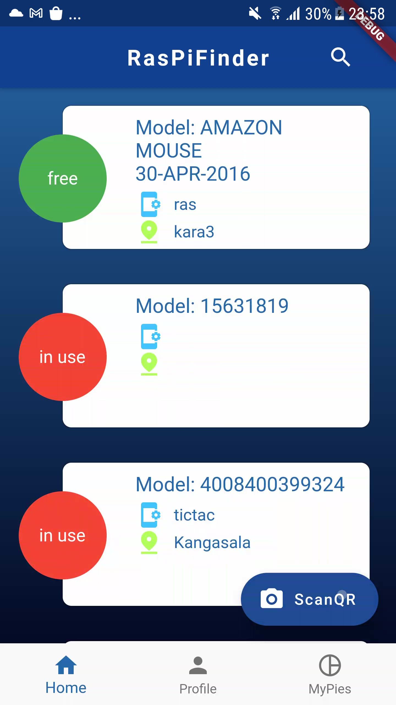
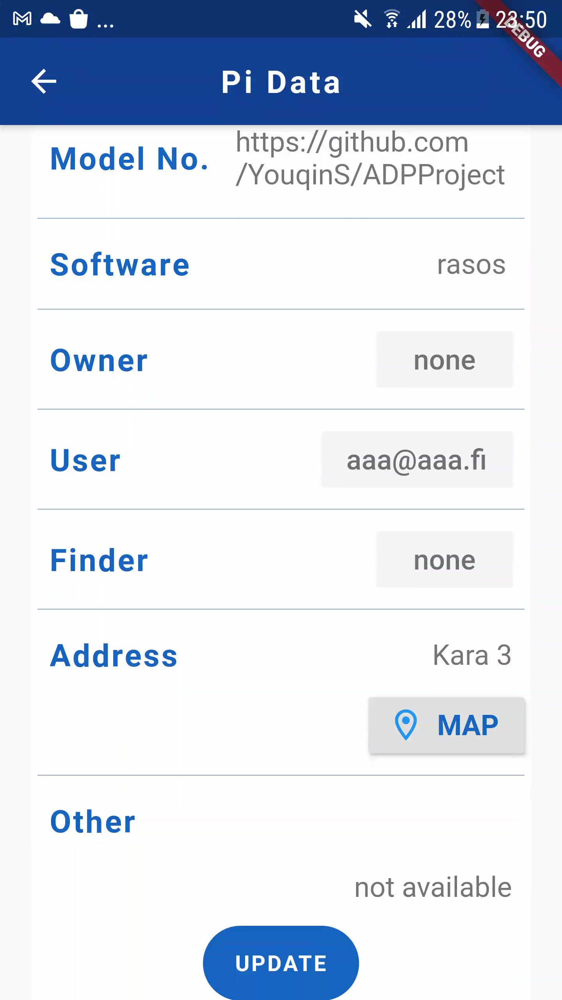
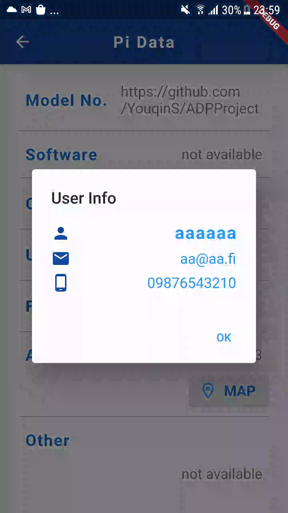
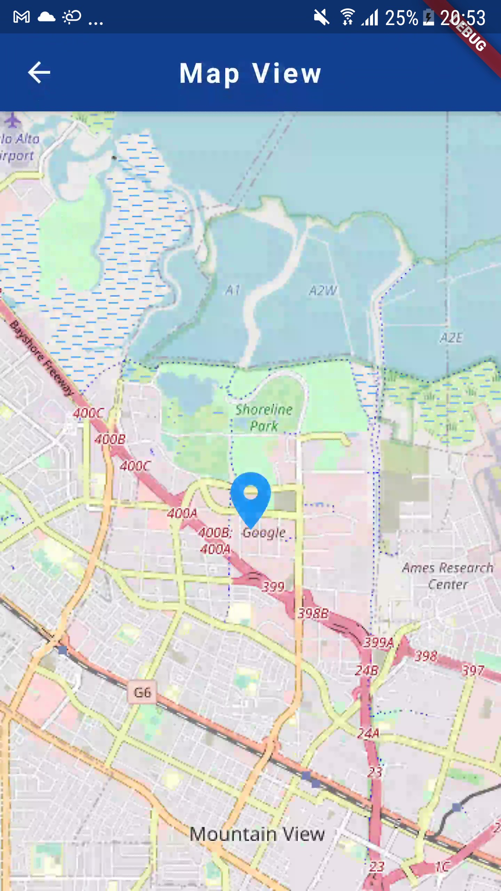
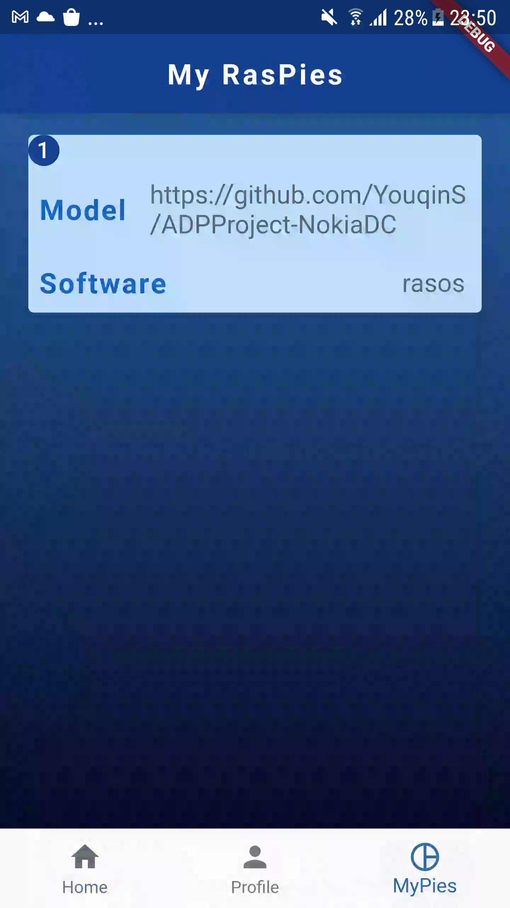
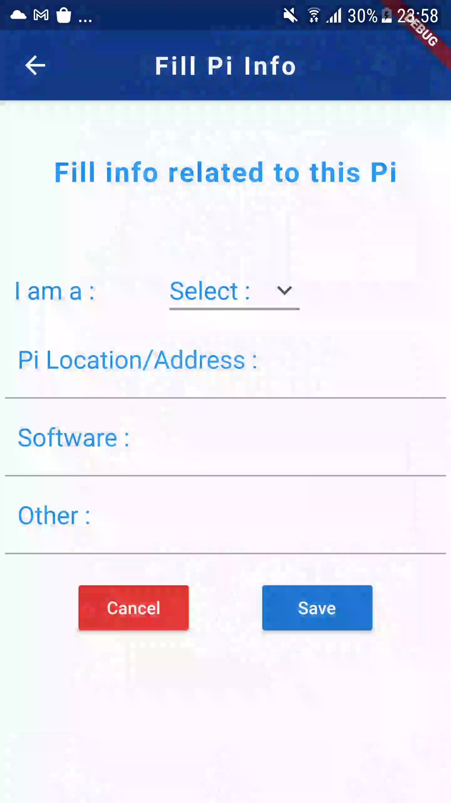
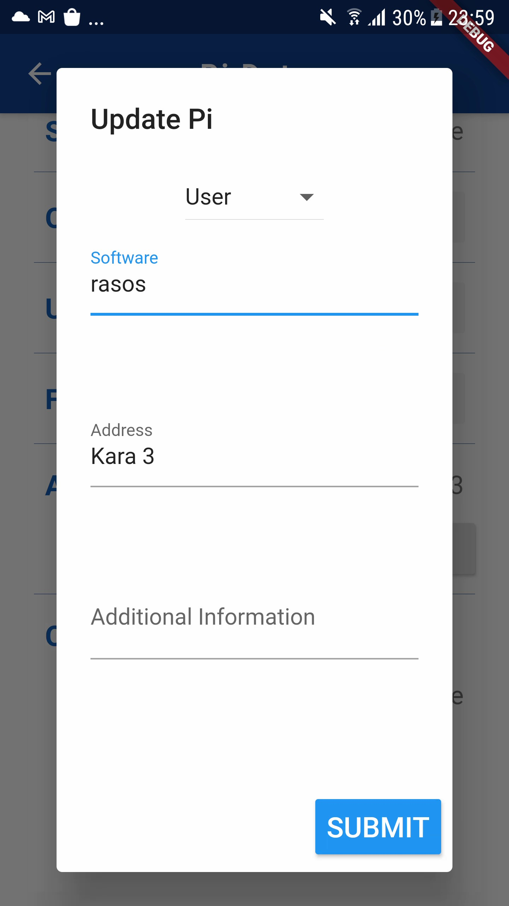
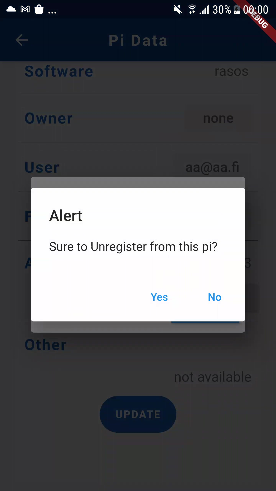
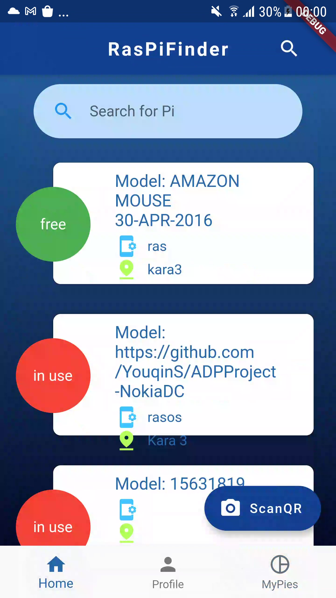

# [RasPiFinder](https://github.com/YouqinS/ADPProject-NokiaDC)

A mobile application for qr-code based asset inventory management 
implemented with Flutter & Dart (compatible with iOS and Android) and Google firestore 
by students from Metropolia University of Applied Sciences for their Innovation Project course

The project was offered and co-supervised by Metropolia and Nokia.

## Download APK and install it on your phone to test the App
[app-arm64-v8a-release.apk](https://github.com/YouqinS/ADPProject-NokiaDC/blob/ReadMe/app-arm64-v8a-release.apk)

[app-armeabi-v7a-release.apk](https://github.com/YouqinS/ADPProject-NokiaDC/blob/ReadMe/app-armeabi-v7a-release.apk) 


## [How to setup Google firestore](https://github.com/YouqinS/ADPProject-NokiaDC)


## How to setup for further development (Android)
1. Clone the repository: [RasPiFinder](https://github.com/YouqinS/ADPProject-NokiaDC)
1. Read: [How to setup Google firestore](https://github.com/YouqinS/ADPProject-NokiaDC)
1. Setup your account on Google fire cloud 
1. Setup the connection to database in project
1. Run the project with Android Studio/Visual Studio
1. Setup an emulator device, or connect a mobile deivce to your PC
1. Run the project from your editor on the selected device
1. Allow permission with camera, location and storage
1. App is ready to be tested  


## Hardware and/or software requirements
1. Network connected
1. GPS location
1. Camera (for qr code scanning)

## App Functionalities
#### Home: list of all Pies stored in database
  

#### Pi Data 


#### View user info from Pi Data 


#### Map view of Pi location
   

#### My RasPies 


#### Add a Pi
   

#### Update Pi data
    

#### Unregister from a Pi 
 

#### Search 


#### [Watch Demo video](https://www.youtube.com/watch?v=u8rikaPHONU)

#### [Download Demo video](https://github.com/YouqinS/ADPProject-NokiaDC/blob/ReadMe/app-demo.mp4)


##
## Dependencies
``` 
environment:
  sdk: ">=2.7.0 <3.0.0"

dependencies:
  flutter:
    sdk: flutter
  # qrscan: ^0.2.19
  qrscans: ^0.0.7
  shared_preferences: ^0.5.12+4
  introduction_screen: ^1.0.9


  # The following adds the Cupertino Icons font to your application.
  # Use with the CupertinoIcons class for iOS style icons.
  cupertino_icons: ^0.1.3
  image_picker: ^0.6.7+11
  #http request
  http: ^0.12.2
  #async package to add additional cancelable operations
  async: ^2.4.2
  # get it
  get_it: ^5.0.1
  # provider
  provider: ^4.3.2+2
  # provider architecture
  provider_architecture: ^1.1.1+1
  firebase_auth: ^0.18.1+1
  cloud_firestore: ^0.14.0+2
  firebase_core: ^0.5.0+1
  flutter_spinkit: ^4.1.2+1
  flutter_map: 0.10.1
  geolocator: ^6.1.0
  flutter_vector_icons: ^0.2.1
  fluttertoast: ^7.1.5

dev_dependencies:
  flutter_test:
    sdk: flutter
    ```


